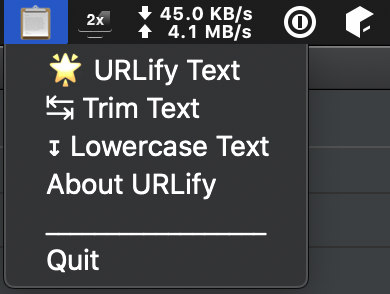

# URLify

A simple macOS app and command-line tool to create valid file and url names from clipboard text.



## Table of Contents

- [Introduction](#introduction)
- [Installation](#installation)
  - [macOS App](#macos-app)
  - [Command-Line Tool](#command-line-tool)
- [CLI Usage](#cli-usage)
  - [Basic Usage](#basic-usage)
  - [Available Commands](#available-commands)
  - [Input Sources](#input-sources)
  - [Output Options](#output-options)
  - [Command Aliases](#command-aliases)
  - [Help and Documentation](#help-and-documentation)
- [Launching app](#launching-app)
- [Building locally](#building-locally)

## Introduction

If you ever need to take text like this:

**Fastest drivers' times**

And convert it to something you could use in a URL or filename, such as:

**fastest-drivers-times**

Then here's a simple macOS menubar app and command-line tool that does text transforms such as these with a single click (GUI) or command (CLI). It just takes the text in the clipboard and replaces it with a filename friendly version.

## Installation

### macOS App

Just download the latest release .zip file, uncompress it and copy `urlify.app` into your Applications folder. 

Latest release at: [github.com/mikeckennedy/urlify/releases](https://github.com/mikeckennedy/urlify/releases/latest)

If you want URLify to start when you login, 
just [follow these steps](https://www.idownloadblog.com/2015/03/24/apps-launch-system-startup-mac/):

1. Open System Preferences
2. Click Users & Groups
3. Click Login Items
4. Click the '+' sign and find urlify.app
5. click the Add button

### Command-Line Tool

For the CLI version, clone this repository and install the dependencies:

```bash
git clone https://github.com/mikeckennedy/urlify.git
cd urlify
pip install -r requirements.txt
```

Then you can run the CLI directly:

```bash
python cli.py --help
```

## CLI Usage

The command-line interface provides all the same functionality as the GUI app, with convenient defaults and multiple input options. Perfect for automation, scripting, and power users who prefer the command line.

### Basic Usage

By default, URLify will read from your clipboard and perform URL-friendly conversion:

```bash
# Convert clipboard text to URL format (default behavior)
python cli.py

# Convert specific text to URL format
python cli.py --text "Hello World! This is a Test"

# Pipe text through URLify
echo "Some Title Text" | python cli.py
```

### Available Commands

All the GUI transformations are available as CLI commands:

```bash
# Text transformations
python cli.py urlify --text "Hello World!"           # hello-world (default command)
python cli.py lowercase --text "HELLO WORLD"         # hello world
python cli.py uppercase --text "hello world"         # HELLO WORLD
python cli.py trim --text "  spaced text  "          # spaced text
python cli.py capitalize-first --text "hello world"  # Hello world
python cli.py capitalize-all --text "hello world"    # Hello World

# URL operations
python cli.py remove-query --text "https://example.com?param=value"  # https://example.com

# Data extraction
python cli.py excel-friendly --text "abc123.45def"   # 123.45
```

### Input Sources

The CLI accepts input from multiple sources (in priority order):

1. **Direct text**: `--text "your text here"`
2. **Stdin pipe**: `echo "text" | python cli.py command`
3. **Clipboard**: (default when no other input provided)

### Output Options

```bash
# Quiet mode (only output the result)
python cli.py --quiet --text "Hello World"

# Copy result back to clipboard
python cli.py --copy-to-clipboard --text "Hello World"

# Combine options
python cli.py --quiet --copy-to-clipboard --text "Hello World"
```

### Command Aliases

Many commands have convenient short aliases:

```bash
python cli.py lc --text "HELLO"          # same as lowercase
python cli.py uc --text "hello"          # same as uppercase  
python cli.py rq --text "url?param=val"  # same as remove-query
python cli.py cf --text "hello world"    # same as capitalize-first
python cli.py ca --text "hello world"    # same as capitalize-all
```

### Help and Documentation

```bash
python cli.py --help              # Show all commands and options
python cli.py urlify --help       # Show help for specific command
python cli.py --version           # Show version information
```

## Launching app

The first time you download the app, macOS may give you a warning that the developer is not verified and it can't run. You're welcome to heed that warning, but if you trust it enough, right-click and choose open rather than double-clicking it and then you'll get a prompt where you can run anyway.

After running once, macOS will allow it to run without complaining afterwards.

## Building locally

If you want to build from source, it's pretty standard Python:

### For the CLI tool:

```bash
# Clone and set up
git clone https://github.com/mikeckennedy/urlify.git
cd urlify
pip install -r requirements.txt

# Use the CLI directly
python cli.py --help
```

### For the macOS app:

```bash
# Create and activate a virtual environment
pip install -r requirements.txt
python build_app.py py2app 
```

The output `.app` file will be in the `dist` folder.